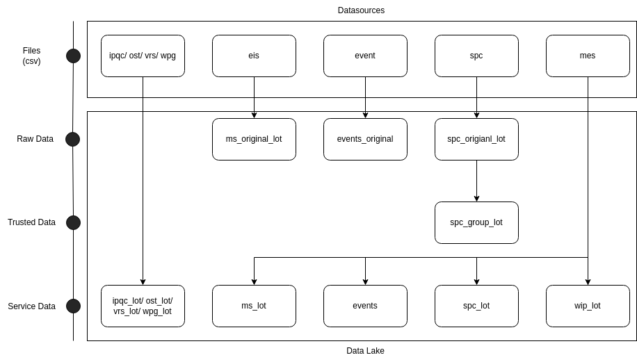
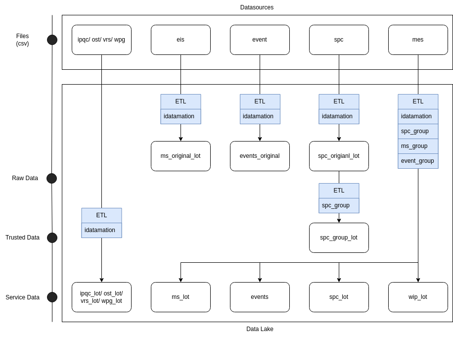
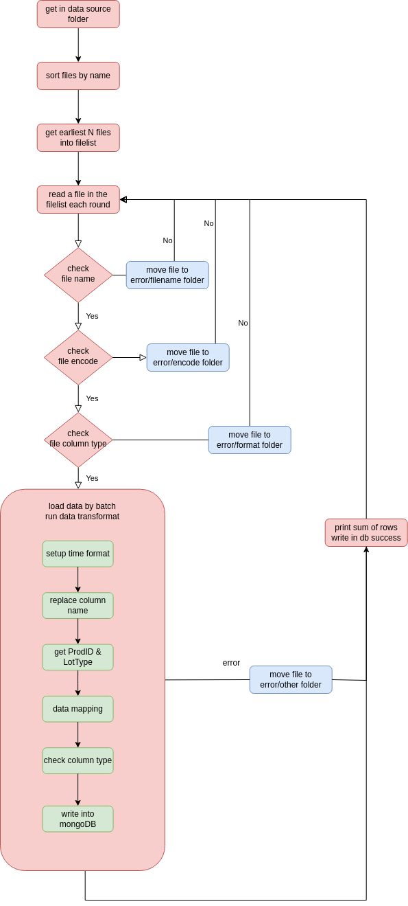

# Data_Lake_Design

<!-- PROJECT LOGO -->
 

  <h1 align="center">File Description</h1>

  

    Unimicron data description
       
  

<!-- TABLE OF CONTENTS -->

  
Data Sources

  <ol>
    <li>
      <a>生產履歷</a>
      <ul>
        <li><a href="#wip">WIP</a></li>
      </ul>
    </li>
    <li>
      <a>量測資料</a>
      <ul>
        <li><a href="#ipqc">IPQC</a></li>
        <li><a href="#ost">OST</a></li>
        <li><a href="#spc">SPC</a></li>
        <li><a href="#vrs">VRS</a></li>
        <li><a href="#wpg">WPG</a></li>
      </ul>
    </li>
    <li>
      <a>監控資料</a>
      <ul>
        <li><a href="#ms">MS</a></li>
        <li><a href="#event">EVENT</a></li>
      </ul>
    </li>
    <li>
      <a>規則資料</a>
      <ul>
        <li><a href="#spc_plan">SPC_PLAN</a></li>
        <li><a href="#spc_plan_oqc_mapping">SPC_PLAN_OQC_MAPPING</a></li>
        <li><a href="#spc_plan_v5">SPC_PLAN_V5</a></li>
      </ul>
    </li>
    <li>
      <a>資料處理</a>
      <ul>
        <li><a href="#event_group">EVENT_GROUP</a></li>
        <li><a href="#ms_group">MS_GROUP</a></li>
        <li><a href="#spc_group">SPC_GROUP</a></li>
      </ul>
    </li>
    <li>
      <a>流程輔助</a>
      <ul>
        <li><a href="#idatamation_module">IDATAMATION_MODULE</a></li>
        <li><a href="#data_mapping">DATA_MAPPING</a></li>
      </ul>
    </li>
  </ol>

<!-- DATA DESCRIPTION -->
## DESCRIPTION

| 項目 |
| ---- |
| dagID |
| fileName |
| process |
| description |

### 生產履歷
#### WIP  
| 項目 | 內容 |
| ---- | ---- |
| dagID | mes_idatamation |
| fileName | mes_module.py |  
| process | csv --> wip_lot |  
| description | csv檔案檢查後寫入wip_lot數據集 |
| note | wip_lot寫入後驅動data_process底下的程序，包含:eis/event/spc資料處理 針對該批wip內所有lot，回找對應資料，並組成Service Data供前台應用展示或分析使用 詳細內容見下方[data process](https://gitlab.aibdt.com.tw/system/t3-data-transfer/-/wikis/ETL-process#event_group) |

### 量測資料
#### IPQC
| 項目 | 內容 |
| ---- | ---- |
| dagID | wpg_idatamation |
| fileName | wpg_module.py |  
| process | csv --> ipqc_lot | 
| description | csv檔案檢查後寫入ipqc_lot數據集 |

#### OST
| 項目 | 內容 |
| ---- | ---- |
| dagID | ost_idatamation |
| fileName | ost_module.py |  
| process | csv --> ost_lot | 
| description | csv檔案檢查後寫入ost_lot數據集 |

#### SPC
| 項目 | 內容 |
| ---- | ---- |
| dagID | spc_idatamation |
| fileName | spc_module.py |  
| process | csv --> spc_original_lot --> (spc_lot) | 
| description | csv檔案檢查後寫入spc_original_lot數據集， 再將該批資料彙整成數學資料後存入spc_group_lot， (最後經由mes_idatamation驅動data_mapping，將對應spc_group_lot資料取出後，補齊缺失值再存入spc_lot) |
| note | 彙整數學資料的class位於data_process/spc_group.py底下 |

#### VRS
| 項目 | 內容 |
| ---- | ---- |
| dagID | vrs_idatamation |
| fileName | vrs_module.py |  
| process | csv --> vrs_lot | 
| description | csv檔案檢查後寫入vrs_lot數據集 |

#### WPG
| 項目 | 內容 |
| ---- | ---- |
| dagID | wpg_idatamation |
| fileName | wpg_module.py |  
| process | csv --> wpg_lot | 
| description | csv檔案檢查後寫入wpg_lot數據集 |

## 監控資料
#### MS  
| 項目 | 內容 |
| ---- | ---- |
| dagID | eis_idatamation |
| fileName | eis_module.py |  
| process | csv --> ms_original_lot --> (ms_lot) | 
| description | csv檔案檢查後寫入ms_original_lot數據集， (後經由mes_idatamation驅動data_mapping，將對應ms_original_lot資料取出後，補齊缺失值再存入ms_lot) |

 
#### EVENT
| 項目 | 內容 |
| ---- | ---- |
| dagID | event_idatamation |
| fileName | event_module.py |  
| process | csv --> event_original --> (event_lot) | 
| description | csv檔案檢查後寫入event_original數據集， (後經由mes_idatamation驅動data_mapping，將對應event_original資料取出後，補齊缺失值再存入event_lot) |

## 規則資料
#### SPC_PLAN
| 項目 | 內容 |
| ---- | ---- |
| dagID | spc_plan_idatamation |
| fileName | spc_plan_module.py |  
| process | csv --> spc_plan | 
| description | csv檔案檢查後寫入spc_plan數據集 |
| note | spc_plan有欄位需要與spc_plan_oqc_mapping合併，須先對db餵入spc_plan_oqc_mapping |

#### SPC_PLAN_OQC_MAPPING
| 項目 | 內容 |
| ---- | ---- |
| dagID | spc_plan_oqc_idatamation |
| fileName | spc_plan_oqc_module.py |  
| process | csv --> spc_plan_oqc_mapping | 
| description | csv檔案檢查後寫入spc_plan_oqc_mapping數據集 |
| note | spc_plan有欄位需要與spc_plan_oqc_mapping合併，須先對db餵入spc_plan_oqc_mapping |

#### SPC_PLAN_V5
| 項目 | 內容 |
| ---- | ---- |
| dagID | spc_plan_v5_idatamation |
| fileName | spc_plan_v5_module.py |  
| process | csv --> spc_plan_v5 | 
| description | csv檔案檢查後寫入spc_plan_v5數據集 |
| note | 暫無任何分析或資料mapping需要此數據集 |

## 資料處理
- 位於data_process資料夾下
- 由mes_idatamation驅動，對缺失值進行data mapping，並整合資料後寫入新數據集
 
#### EVENT_GROUP
| 項目 | 內容 |
| ---- | ---- |
| dagID | (無) |
| fileName | event_group.py |  
| process | event_original --> event_lot | 
| description | 將wip對應event_original資料取出後，補齊缺失值再存入event_lot |
| note | 經實驗證明，lot_id為null的資料並非缺失值，其資料不與任何lot相關，勿與wip_lot進行lot_id mapping |

#### MS_GROUP
| 項目 | 內容 |
| ---- | ---- |
| dagID | (無) |
| fileName | ms_group.py |  
| process | ms_original_lot --> ms_lot | 
| description | 將wip對應ms_original_lot資料取出後，補齊缺失值再存入ms_lot |
| note | 經實驗證明，lot_id為null的資料並非缺失值，其資料不與任何lot相關，勿與wip_lot進行lot_id mapping |

#### SPC_GROUP
| 項目 | 內容 |
| ---- | ---- |
| dagID | (無) |
| fileName | spc_group.py |  
| process | spc_group_lot --> spc_lot | 
| description | 將wip對應spc_group_lot資料取出後，補齊缺失值再存入spc_lot |
| note | 經實驗證明，lot_id為null的資料並非缺失值，其資料不與任何lot相關，勿與wip_lot進行lot_id mapping |

## 輔助流程
#### IDATAMATION_MODULE
| 項目 | 內容 |
| ---- | ---- |
| dagID | (無) |
| fileName | idatamation_module.py |  
| process | 檢查file名稱 --> 檢查欄位名稱 --> 檢查資料型態 --> 寫入mongoDB | 
| description | 為idatamation檔案的共用代碼庫，被module.py繼承 |
| note | 經實驗證明，lot_id為null的資料並非缺失值，其資料不與任何lot相關，勿與wip_lot進行lot_id mapping |

#### data_process
針對 spc/ event/ ms資料做mapping   
##### spc_group
| 項目 | 內容 |
| ---- | ---- |
| dagID | (無) |
| fileName | spc_group.py |  
| process | 1.把spc_original_lot資料整合 --> 計算mean值/std(標準差) --> 寫入(mongodb)spc_group_lot 2.從(mongodb)spc_group_lot取出時間上對應的資料 --> mapping step/eqp --> mapping prod_id --> 寫入(mongodb)events  | 
| description | 步驟1/2來自兩個不同class，分別搭配spc_module/mes_module使用 |
| note | 勿直接使用spc的step & eqp，因其命名方式與wip相差過大 |

##### event_group
| 項目 | 內容 |
| ---- | ---- |
| dagID | (無) |
| fileName | event_group.py |  
| process | 從(mongodb)event_origianl取出時間上對應的資料 --> mapping step --> mapping prod_id --> 寫入(mongodb)events | 
| description | 繼承data_mapping，使用共同mapping functions |
| note |  |

##### ms_group
| 項目 | 內容 |
| ---- | ---- |
| dagID | (無) |
| fileName | ms_group.py |  
| process | 從(mongodb)ms_origianl_lot取出時間上對應的資料 --> mapping step --> mapping prod_id --> 壓縮parameter&time資料 --> 寫入(mongodb)ms_lot | 
| description | 繼承data_mapping，使用共同mapping functions |
| note | 壓縮後的ms_lot資料難以使用時間方式進行排序或搜索，其架構當初設計可能是為了符合istrategy ms方便使用，但其架構複雜度難以進行其他開發 |
